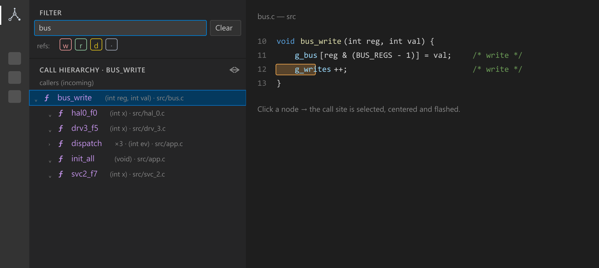
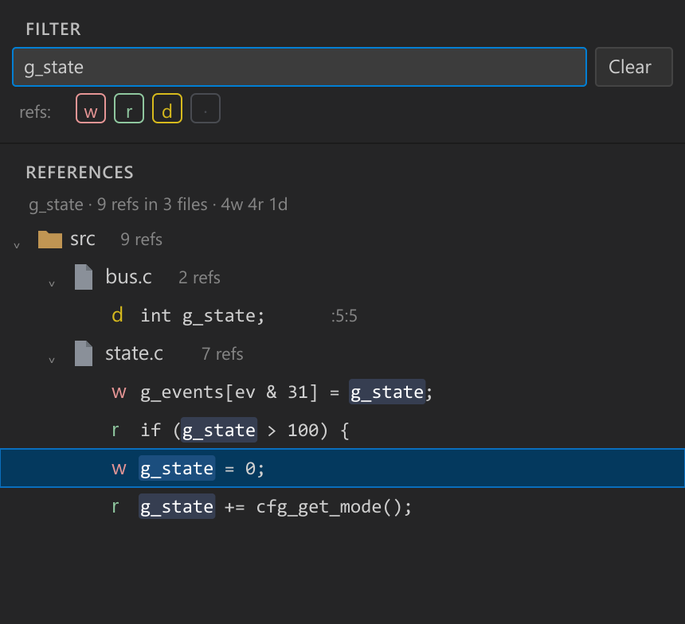

<h1 align="center">C Call Hierarchy & References</h1>

<p align="center">
  See <b>who calls what</b> and <b>who reads vs writes</b> a symbol in C/C++ —
  powered by your <a href="https://clangd.llvm.org/">clangd</a>.
</p>

<p align="center">
  <a href="https://marketplace.visualstudio.com/items?itemName=halistahasahin.c-call-hierarchy-references"></a>
  
  
  
</p>

<p align="center">
  
</p>

clangd already knows your code. **C Call Hierarchy & References** re-presents what it knows the way you actually want
it: callers **and** callees at once, references split into **reads vs writes**, and third-party noise
filtered out — without leaving the sidebar.

> It does **not** run its own language server. It consumes clangd's results through VS Code's provider
> commands, so accuracy equals clangd's accuracy — with zero extra setup.

---

## ✨ Features

### Call hierarchy — incoming or outgoing
Put the cursor on a function and run **Show call hierarchy**. The tree shows **callers (incoming)** or
**callees (outgoing)** — flip between them with the toggle in the view title. Nodes show the function's
**parameter types**, a **×N** badge when clangd merges several call sites into one, and are cycle-safe and
depth-capped. Selecting a node **previews** the call site — selected, centered and briefly flashed — while
**focus stays in the tree**, so you can keep arrowing up and down the hierarchy. The inline **Open in
editor** action jumps there for real and moves focus to the editor.

### Find references — read vs write


**Find references** opens a dedicated tree where every occurrence is badged:

- <b style="color:#E69595">w</b> — **write** (assignment, `++`/`--`, compound assignment)
- <b style="color:#8FC79F">r</b> — **read**
- <b style="color:#5FB7C9">&</b> — **address-of** (`&x`) — a potential write through the pointer
- <b style="color:#D7BA1D">d</b> — **declaration / definition**
- **·** — unknown (e.g. inside a macro)

Group by **folder** or flat by **file**, toggle which kinds show with the **w r d ·** chips, and the
matched symbol is highlighted on each line. Read/write comes from clangd's `documentHighlight` roles, with
a syntactic fallback when the provider doesn't tag a role.

<br clear="right">

### One filter for everything
A fixed **Filter** pane at the top searches by **function name or path** across both views, live:

| You type | Match |
| --- | --- |
| `bus` | case-insensitive **contains** (name or path) |
| `src/net/**` | **glob** |
| `/drv_\d+/` | **regular expression** |

---

## ✅ Requirements

- The **clangd** extension (`llvm-vs-code-extensions.vscode-clangd`), installed and active — for the call
  hierarchy, references and signatures.
- A clangd index for your project: a `compile_commands.json` or `compile_flags.txt`.

> If both **clangd** and **ms-vscode.cpptools** are installed, make sure clangd is the active C/C++
> provider for best read/write accuracy.

## 🚀 Getting started

1. Install this extension and **clangd**, and open a C/C++ project that clangd can index.
2. Click the **C Call Hierarchy & References** icon in the Activity Bar.
3. Right-click a function → **Show call hierarchy** / **Find references**.

## ⚙️ Settings

| Setting | Default | Description |
| --- | --- | --- |
| `cCallHierarchyReferences.maxDepth` | `32` | Max expansion/walk depth for the call tree. |
| `cCallHierarchyReferences.excludeGlobs` | `[]` | Deny-list of path globs hidden from all views. |
| `cCallHierarchyReferences.includeGlobs` | `[]` | Allow-list of path globs; empty = show everything. |
| `cCallHierarchyReferences.showSignatures` | `true` | Show caller parameter types in the call tree. |

## 🧠 How it works

For call hierarchy, references and signatures the extension calls VS Code's built-in provider commands
(`prepareCallHierarchy`, `provideIncoming/OutgoingCalls`, `executeReferenceProvider`,
`executeDocumentHighlights`, `executeHoverProvider`) which delegate to **your clangd**. No second language
server is spawned.

## ❓ FAQ

**Nothing shows up.** Make sure the clangd extension is installed, active, and has finished indexing
(watch its status item), and that clangd — not cpptools — is answering.

**Read/write looks wrong.** Read/write is recovered from clangd's highlight roles; if another provider
answers without roles, a syntactic fallback kicks in. Globals/struct fields are the clearest demo.

**Both callers and callees are shown — can I get only one?** Expand just the branch you care about; the
other stays collapsed.

## 🛠️ Develop

```sh
npm install
npm run compile      # or: npm run watch
```

Press **F5** to launch an Extension Development Host with the bundled `example-large/` project (regenerate
or scale it with `node tools/gen-large-example.js`).

## 📄 License

[MIT](LICENSE) © Halis Taha Sahin
